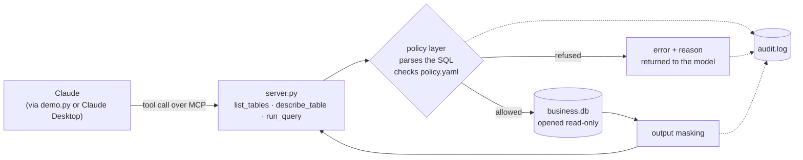

# mcp-sql-server

[](https://github.com/batuhansutculer/mcp-sql-server/actions/workflows/tests.yml)

A Model Context Protocol (MCP) server that lets an AI assistant (Claude) query a
business database in plain language — behind a policy-enforced access layer.

This is a self-contained prototype of a pattern I build in professional work:
exposing structured business data to an AI agent through well-defined tools, where
what the agent may read is decided **server-side, in configuration**, not by the
prompt. The database and data here are mock, so the whole thing can be public; the
design mirrors real production tooling I've built to connect Claude to live
business systems.

## Architecture



Two independent boundaries sit between the model and the data. The policy layer
refuses queries before they run; the connection is opened read-only, so a write
that somehow got past the policy layer still fails at the driver. Every attempt,
allowed or refused, is written to the audit log.

## The tools

| Tool | Purpose |
|------|---------|
| `list_tables()` | Lists tables, each flagged with whether the policy allows reading it |
| `describe_table(name)` | Returns columns and types, each flagged as masked or not |
| `run_query(sql)` | Validates a read-only query against the policy, runs it, masks the results |

With these, Claude explores the schema and answers real questions by writing the
SQL itself — for example, *"Which customer spent the most?"* requires joining three
tables and computing `quantity × price`, since orders don't store a total.

The mock database models a small business: `customers`, `products`, `orders`, and a
sensitive `payment_methods` table.

## The policy layer

Access rules live in [`policy.yaml`](policy.yaml), not in code:

```yaml
allowed_statements: [SELECT]
denied_tables:
  - payment_methods
  - sqlite_master
masked_columns:
  customers: [email]
max_rows: 500
```

The same server enforces a different policy per deployment — analyst, support,
admin — without touching `server.py`.

### Validation runs on a parsed query, not on the text

The obvious implementation is a string check: does the query start with `select`,
does it contain `payment_methods`. That is easy to write and wrong in both
directions. It rejects `WITH ... SELECT`, which is an ordinary read that Claude
writes routinely. And it cannot tell a table reference from the same word inside a
string literal.

So the query is parsed with [`sqlglot`](https://github.com/tobymao/sqlglot) and the
resolved table references are checked against the policy:

```python
parsed = sqlglot.parse_one(sql, dialect="sqlite")
referenced = {t.name.lower() for t in parsed.find_all(exp.Table)}
if denied := referenced & policy.denied_tables:
    raise PolicyError(f"Access to {', '.join(denied)} is restricted.")
```

A restricted table is then unreachable however it's referenced — directly, through
a join, a subquery, a `UNION`, or a CTE. Those cases are in the test suite.

### Masking fails closed

Hiding a column's values only works if they can't be recovered indirectly.
`WHERE email LIKE 'a%'` reads a masked value one character at a time; an alias or a
function wrapper changes the output column name and defeats masking that matches on
it. So a masked column may appear only as a plainly selected column, and anything
else is refused rather than silently allowed.

Masking itself is applied to the result set rather than the query, which is what
makes `SELECT *` work: the column never appears in the SQL, but the cursor reports
its real name.

### The boundary that doesn't depend on application code

The connection is opened read-only at the driver:

```python
sqlite3.connect(f"{DB_PATH.as_uri()}?mode=ro", uri=True)
```

This is the layer that holds if the policy layer has a bug. A test bypasses the
policy entirely and confirms the database still refuses to change.

### Audit log

Every tool call appends one JSON object to `audit.log` — the query, the decision,
and the reason for a refusal:

```json
{"timestamp": "2026-08-03T21:44:02+00:00", "tool": "run_query", "decision": "denied",
 "sql": "SELECT * FROM payment_methods", "reason": "Access to payment_methods is restricted."}
```

An access-control layer you can't review after the fact is hard to trust, and
*"show me what the agent actually ran"* is the first question anyone asks when an
AI system touches customer or financial data. JSON Lines so it's queryable:

```bash
cat audit.log | jq 'select(.decision == "denied")'
```

## What the tools return

Real output from the tools (see [`tests/`](tests/) for these as assertions).

**An analytical query** — results come back as columns and rows, so the model isn't
inferring the schema from tuple positions:

```json
{"columns": ["name", "total"],
 "rows": [["Anna Schmidt", 1097.0], ["Luca Rossi", 899.0],
          ["Marie Dubois", 447.0], ["Tom Becker", 299.0]],
 "row_count": 4, "truncated": false}
```

**A masked column** — the rows still return, the values don't:

```json
{"columns": ["name", "email"],
 "rows": [["Anna Schmidt", "***"], ["Luca Rossi", "***"],
          ["Marie Dubois", "***"], ["Tom Becker", "***"]],
 "row_count": 4, "truncated": false}
```

**A restricted table, reached through a subquery:**

```
SELECT name FROM customers WHERE id IN (SELECT customer_id FROM payment_methods)
```
```json
{"error": "Access to payment_methods is restricted.",
 "hint": "This table holds sensitive data and is not available."}
```

**An attempt to filter on a masked column:**

```json
{"error": "Column 'email' is masked and cannot be used in filters, functions, or aliases.",
 "hint": "You may select email directly, but its values are hidden."}
```

**A write:**

```json
{"error": "Only SELECT queries are allowed (got DROP).", "hint": "This tool is read-only."}
```

Refusals carry a reason and a hint because the message is part of the interface —
the model has to be able to work out what to do instead. The same applies to
ordinary failures: a query against a table that doesn't exist returns an error
naming the available tables, not a traceback.

## Running it

**Requirements:** Python 3.10+ and [uv](https://docs.astral.sh/uv/).

```bash
uv sync
uv run setup_database.py
```

### From the command line

[`demo.py`](demo.py) is an MCP client: it launches the server as a subprocess,
speaks the protocol over stdio, hands Claude the three tools, and runs the
tool-use loop until Claude has an answer. Set `ANTHROPIC_API_KEY`, then:

```bash
uv run demo.py "Which customer spent the most?"
```

Claude explores the schema and writes the SQL itself, so the calls it makes and
the wording of its answer vary between runs. The transcript prints each tool
call and a one-line summary of what came back, then the answer — in this shape:

```
MCP server ready -- tools: list_tables, describe_table, run_query

> Which customer spent the most?

  -> list_tables()
     customers, orders, payment_methods [restricted], products
  -> run_query(sql=SELECT c.name, SUM(p.price * o.quantity) AS total FROM ...)
     4 row(s)

<Claude's answer>
```

A refused query is reported as a refusal rather than being flattened into an
empty result, so hitting the guardrail is visible in the same transcript:

```
  -> run_query(sql=SELECT * FROM payment_methods)
     REFUSED -- Access to payment_methods is restricted.
  -> run_query(sql=SELECT name FROM customers WHERE email LIKE 'a%')
     REFUSED -- Column 'email' is masked and cannot be used in filters, functions, or aliases.
```

Because this goes through the real protocol rather than importing the tool
functions, it exercises the MCP layer, the policy layer, and the read-only
connection together. Add `--verbose` to see the server's own logs.

### In Claude Desktop

1. Register the server — add this to
   `claude_desktop_config.json` (Settings → Developer → Edit Config), using the
   absolute path to this folder:
   ```json
   {
     "mcpServers": {
       "mcp-sql-server": {
         "command": "uv",
         "args": ["--directory", "/absolute/path/to/mcp-sql-server", "run", "server.py"]
       }
     }
   }
   ```

3. Fully restart Claude Desktop, then ask it something like *"Which customer spent
   the most?"* and watch it explore the schema and write the query itself.

## Tests

```bash
uv run pytest
```

62 tests covering the policy layer, the tools, and the demo client's output
formatting. The ones that matter most are the bypass attempts — a guardrail is
only as good as the attacks it survives:

| Attempt | Result |
|---------|--------|
| `SELECT * FROM payment_methods` | refused |
| `SELECT * FROM PAYMENT_METHODS` | refused — case |
| `... WHERE id IN (SELECT ... FROM payment_methods)` | refused — subquery |
| `... JOIN payment_methods ON ...` | refused — join |
| `WITH leak AS (SELECT * FROM payment_methods) ...` | refused — CTE |
| `SELECT * FROM customers UNION SELECT * FROM payment_methods` | refused — union |
| `SELECT sql FROM sqlite_master` | refused — schema disclosure |
| `SELECT * FROM customers; DROP TABLE orders` | refused — multiple statements |
| `SELECT name FROM customers WHERE email LIKE 'a%'` | refused — masked column in filter |
| `SELECT upper(email) FROM customers` | refused — masked column in function |
| `SELECT email AS contact FROM customers` | refused — masked column aliased |
| `SELECT name FROM customers WHERE name != 'payment_methods'` | **allowed** — string literal, not a table |
| `DELETE FROM orders` bypassing the policy entirely | refused by the read-only connection |

That last-but-one row is the case a text-matching guard gets wrong: there is no
table reference in it, and parsing knows the difference.

## Limitations

- **The policy covers tables and columns, not rows.** There's no concept of "this
  user may see their own orders only." Row-level policy is the natural next step
  and would need the query rewritten with an injected predicate, not just validated.
- **Masking is enforced by refusing indirect use, which is blunt.** A legitimate
  `COUNT(email)` is refused along with `WHERE email LIKE 'a%'`. Failing closed is
  the right default, but a real system would classify expressions by whether they
  actually leak values rather than rejecting all of them.
- **Masked columns are matched by name across tables.** A result set doesn't carry
  table provenance, so a same-named column on another table would be masked too.
  Safe direction to be wrong in, but imprecise.
- **The strongest boundary is still the database, not this code.** The read-only
  connection is one step; in production the agent would connect as a role with
  table and column grants, so restricted data is unreachable regardless of what
  query is sent or what this server does.
- **`sqlglot` is doing security-relevant work.** Any parser disagreement between it
  and SQLite is a potential gap. Pinning the version and tracking its releases
  matters more than it would for a formatting tool.

## Files

| File | Purpose |
|------|---------|
| [`server.py`](server.py) | The MCP server and its three tools |
| [`policy.py`](policy.py) | Policy loading, SQL validation, output masking |
| [`policy.yaml`](policy.yaml) | The access policy — the part you'd change per deployment |
| [`audit.py`](audit.py) | Append-only JSON Lines audit log |
| [`demo.py`](demo.py) | MCP client — asks Claude a question from the command line |
| [`setup_database.py`](setup_database.py) | Creates and seeds the mock SQLite database |
| [`tests/`](tests/) | Policy and tool tests, including bypass attempts |

## Stack

Python · SQLite · [sqlglot](https://github.com/tobymao/sqlglot) · Model Context Protocol (MCP) · [Anthropic SDK](https://github.com/anthropics/anthropic-sdk-python) · Claude Opus 5

## License

MIT — see [LICENSE](LICENSE).
